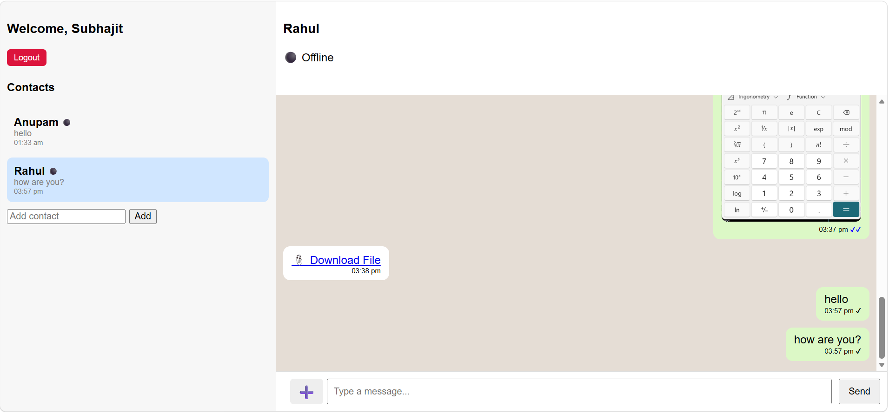

# Real-Time Chat Application

A full-stack real-time chat application inspired by WhatsApp, built using React, Spring Boot, WebSocket, JWT Authentication, and MySQL.

This project supports real-time messaging, online/offline status, typing indicators, unread counts, seen/delivered message status, image/file sharing, and responsive mobile UI.

---

# Features

## Authentication & Security
- User Registration & Login
- JWT Authentication
- BCrypt Password Encryption
- Protected APIs using JWT Filter
- Secure WebSocket Connection

## Real-Time Chat Features
- Real-time messaging using WebSocket + STOMP
- Online / Offline user status
- Typing indicator
- Delivered and Seen message status
- Unread message count
- Last message preview
- Automatic scrolling to latest messages
- Infinite scroll for old messages

## Contacts
- Add contacts
- Duplicate contact prevention
- Persistent contacts stored in database

## Media Sharing
- Send images
- Send files / PDFs / documents
- Image preview modal
- Download shared files
- File size validation

## UI Features
- Responsive mobile-friendly design
- Mobile sidebar/chat switching
- WhatsApp-style chat layout
- Real-time updates without refresh

---

# Tech Stack

## Frontend
- React.js
- JavaScript
- CSS
- SockJS
- STOMP.js

## Backend
- Spring Boot
- Spring WebSocket
- Spring Security
- JWT Authentication
- Hibernate / JPA

## Database
- MySQL

---

# Screenshots

Example:

---

# Installation & Setup

## Backend Setup (Spring Boot)

### 1. Go to backend

cd backend

### 2. Configure MySQL

Update `application.properties`

spring.datasource.url=jdbc:mysql://localhost:3306/chatapp
spring.datasource.username=YOUR_USERNAME
spring.datasource.password=YOUR_PASSWORD

### 3. Run Backend

mvn spring-boot:run

Backend runs on:  http://localhost:8080

---

## Frontend Setup (React)

### 1. Go to Frontend Folder

cd frontend

### 2. Install Dependencies

npm install

### 3. Start Frontend

npm start

Frontend runs on:  http://localhost:3000

---

# API Highlights

## Authentication

### Register

POST /api/auth/register

### Login

POST /api/auth/login

---

## Chat APIs

### Get Contacts

GET /api/chat/contacts

### Add Contact

POST /api/chat/contacts

### Get Messages

GET /api/chat/{roomId}

---

# WebSocket Endpoints

## Connection Endpoint

/ws/chat

## Send Message

/app/send/{roomId}

## Subscribe Messages

/topic/messages/{roomId}

---

# Current Features Completed

- Authentication System
- JWT Security
- BCrypt Password Encryption
- Real-Time Chat
- Online/Offline Status
- Typing Indicator
- Seen / Delivered Status
- Unread Counts
- Image Sharing
- File Sharing
- Mobile Responsive UI
- Infinite Message Scroll
- Last Message Preview

---

# Future Improvements

- Voice messages
- Video calling
- Group chat
- Emoji reactions
- Message reply feature
- Delete messages
- Edit messages
- Push notifications
- Cloud file storage
- Docker deployment

---

# Learning Outcomes

This project helped in learning:

- Full-stack development
- REST APIs
- WebSocket communication
- Authentication & Security
- Real-time systems
- Database design
- React state management
- Responsive UI development

---

# Author

## Subhajit Acharya

Aspiring Software Developer passionate about full-stack development, real-time systems, and scalable applications.

---

# License

This project is open-source and available for learning purposes.

